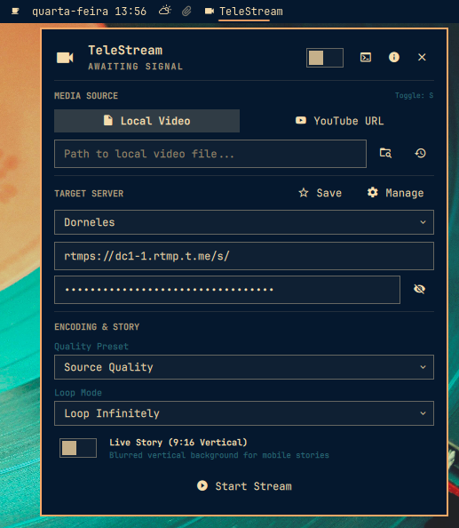

# TeleStream para Omarchy & Quickshell



O TeleStream é um plugin desktop nativo e widget para barra de status no **Omarchy** e **Quickshell** em Wayland (Hyprland), desenvolvido para transmitir arquivos de vídeo locais ou vídeos do YouTube diretamente para servidores RTMP (como Telegram, YouTube, Twitch, Kick) usando `ffmpeg` e `yt-dlp`.

---

## ✨ Recursos

- **Widget de Pílula na Barra de Status (`BarWidget.qml`)**:
  - Exibe status da transmissão em tempo real, cronômetro decorrido, taxa de bits (bitrate) e telemetria de FPS.
  - Clique esquerdo: Abre o painel de controle; Clique do meio: Abre os logs em tempo real; Clique direito: Encerra a transmissão.
- **Painel Central de Controle (`Panel.qml`)**:
  - **Fontes de Mídia**: Transmissão de arquivos locais (integrado ao seletor de arquivos Flea / portal XDG) ou transmissões e vídeos do YouTube via extração HLS de baixa latência.
  - **Histórico das Últimas Fontes**: Salva e exibe automaticamente as últimas 5 fontes utilizadas para cada modo (arquivos locais e URLs do YouTube), com seleção em um clique e exclusão rápida.
  - **Modo Live Story**: Formata o vídeo na proporção vertical 9:16 com desfoque de fundo (blurred background), ideal para transmissões mobile e Telegram Live Stories.
  - **Predefinições de Qualidade**: Opção "Qualidade de Origem" (cópia direta sem recodificação de vídeo e com consumo mínimo de CPU), 1080p, 720p ou 480p com ajuste zerolatency.
  - **Gerenciador de Favoritos**: Salve, edite e alterne facilmente entre múltiplos servidores RTMP (URL e Chave de Stream).
  - **Visualizador de Logs em Tempo Real**: Monitoramento ao vivo da saída do ffmpeg, com limpeza e exportação para arquivo.
  - **Navegação Wayland Keyboard-First**: Atalhos rápidos (`s` iniciar/parar, `l` logs, `f` favoritos, `a` sobre/PIX, `Esc` fechar).
- **Daemon CLI em Segundo Plano (`telestream`)**:
  - Daemon autônomo e independente de janelas gráficas.
  - Interface CLI completa: `telestream start`, `stop`, `status`, `add-recent`, `clear-recent`, etc.

---

## 📋 Pré-requisitos

- **Omarchy** em execução no Wayland / Hyprland
- **Quickshell** (`/usr/bin/quickshell`)
- **ffmpeg**
- **yt-dlp** (para transmissões a partir do YouTube)

Instale as dependências no Arch Linux / Omarchy:
```bash
sudo pacman -S ffmpeg yt-dlp
```

---

## 🚀 Instalação

1. Execute o script de instalação no diretório do projeto:
   ```bash
   ./install.sh
   ```

2. Ative o widget na barra de status do Omarchy:
   ```bash
   omarchy plugin enable dorneles.telestream --section right
   ```

3. Para recarregar o plugin após alterações:
   ```bash
   omarchy restart shell
   ```

---

## 🖥️ Uso via Linha de Comando (CLI)

O instalador cria um link global executável chamado `telestream`:

```bash
# Iniciar transmissão passando a chave via stdin (previne vazamentos de inspeção em /proc/<pid>/cmdline)
printf '%s\n' "SUA_CHAVE" | telestream start --source "/caminho/para/video.mp4" --server "rtmps://dc1-1.rtmp.t.me/s/" --key-stdin

# Ou transmitir utilizando um perfil de servidor favorito (credenciais resolvidas do arquivo 0600)
telestream start --source "/caminho/para/video.mp4" --favorite "Telegram Live"

# Iniciar no modo Live Story (vertical 9:16) com chave via stdin
printf '%s\n' "SUA_CHAVE" | telestream start --source "https://www.youtube.com/watch?v=..." --server "rtmps://..." --key-stdin --story

# Salvar um perfil favorito com a chave transmitida de forma segura via stdin
printf '%s\n' "SUA_CHAVE" | telestream save-favorite "Telegram Live" "rtmps://dc1-1.rtmp.t.me/s/" --key-stdin

# Verificar status da transmissão
telestream status

# Parar transmissão
telestream stop
```

---

## 🔒 Segurança e Gerenciamento de Segredos

O TeleStream segue rigorosamente as diretrizes de segurança e privacidade do Omarchy Quattro:
- **Nenhum segredo em argv**: Os argumentos de linha de comando em `/proc/<pid>/cmdline` são legíveis por qualquer processo no Linux. O TeleStream bloqueia o envio de chaves de transmissão via argumentos `--key` para eliminar vulnerabilidades de inspeção local de processos.
- **Ingestão Segura de Chaves**: Segredos trafegam exclusivamente através de canais protegidos: entrada padrão (`--key-stdin`), descritores de arquivo herdados (`--key-fd`) ou arquivos restritos (`--key-file`). Variáveis de ambiente isoladas não são tratadas como fronteiras confidenciais equivalentes.
- **Armazenamento Protegido**: Perfis favoritos salvos são mantidos exclusivamente em `~/.config/telestream/config.json` com permissões estritas `0600` dentro de diretório privado `0700`.

---

## 🗑️ Desinstalação

Para remover o plugin e o link do comando CLI:
```bash
./uninstall.sh
```

---

## 📄 Licença

Este projeto está licenciado sob a [Licença MIT](LICENSE).


